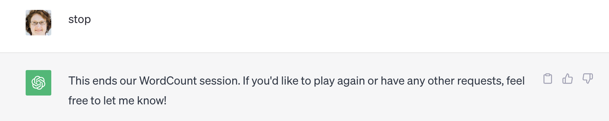

# Prompting ChatGPT to Play a Role in a Human Simulation

The WordCount simulation is an immersive experience where participants 
work for a fictional organization ("WordCount, Inc.") in roles like
product manager, programmer, and tester.
Over the course of the simulation, the participants transform the organization
from siloed and frankly dysfunctional 
to nimble and responsive.

I created the very first version of the WordCount simulation 
back in 2005 as part of 
an agile software development training series.
Since then I have run it over 150 times with over 2000 people taking part.

The original simulation had a number of design goals, including:
* Optimize for an immersive and tech-agnostic experience
* Allow any participant to take on any role without requiring any specialized knowledge
* Model a simplified but realistic software development process

To achieve that last objective, the simulation needed the people playing the role
of programmer
to write some kind of "code" (rather than making paper airplanes or assembling lego blocks
or some other unrelated activity).
However in order for the simulation to remain tech-agnostic, the "code" 
was natural language instructions
executed by other participants who took on the role of "computer."

During the pandemic I attempted to adapt the simulation to the virtual world with 
mixed success. The flow of code from the programmers to the computers proved particularly
challenging.

If ChatGPT could take on the role of "computer" and
execute natural language instructions, I could simplify the interactions in the
virtual world by replacing the computer role with a web app that leveraged ChatGPT on the
back end.

Ultimately I abandoned the project, so there is no web app that you can play with.
(I used ChatGPT's web interface for my experiments; if they had been more successful I would
have written an app against the API.)
However attempting to instruct ChatGPT to replace humans in a simulation taught
me a great deal about prompt engineering. 

## First Steps: Will It Play a Game?

Could ChatGPT follow even simple instructions to play a game? I tried a simple number guessing game.


Success! ChatGPT can play a game with simple instructions.

(Note that I tried this with Anthropic's Claude,
but Claude declined to play.)

## Success Criteria for the WordCount Computer

What would be "good enough" to move forward with ChatGPT as the WordCount computer?
The computer has to be able to:
* Generate different types of responses based on context (e.g. word count results, information, error messages)
* Faithfully execute the instructions as written with no creative interpretation or missing steps
* Produce the same output every time for a given input if the instructions had not changed
* Show the current instruction set if asked
* Allow the instructions to be updated

It is worth noting that I did not manage to draft a successful set of
computer role instructions in the original 
simulation the first time.
It took several tries.
The people in the computer role tended to interpret the code to mean what they 
thought the programmers intended rather than
what the programmers actually wrote.
There is probably a lesson here about how writing good instructions
is challenging, whether the audience is human, a compiler, or an AI.

## Seeding Bugs

In the original simulation, the people playing the computer role started with three artifacts:
* an [instruction sheet](./artifacts/wordcount_computer_role.pdf)
* an ["operating system"](./artifacts/wordcount_computer_os.pdf)
* an [initial version of the code](./artifacts/wordcount_computer_code.pdf)

The resulting system 
comes close to but does not quite meet the
customer requirements.
It has two issues that the participants must find and address: 
1. The words are case sensitive, but should be treated as case-insensitive
2. Punctuation is treated the same as letters

That is, given an input: 

`A boy goes for a walk.`

According to the initial set of instructions, the computer should output:

```
A - 1
boy - 1
goes - 1
for - 1
a - 1
walk. - 1
```

But the customer wants:

```
a - 2
boy - 1
goes - 1
for - 1
walk - 1
```

My goal was to write a prompt for ChatGPT that would result in the same behavior.

## Original Experiment Transcripts

I originally tried this experiment in July 2023.
You can find the transcripts from those experiments
in the [transcripts folder](./transcripts) in this repository.

The starting point was a single prompt that I synthesized from the original artifacts.

```
I would like to play a game. Here are the instructions:

1) Use the following rules for processing the Input to generate the Output.

1A) A word is a set of characters separated from other characters by one or more spaces. So the following is a word with 4 characters (d, o, g, and period): dog.

1B) Lower case and upper case letters are distinct characters. So “Apple” is a different word from “apple”.

1C) Your job is to count words in the Input and return either Output or an Error in response. You follow instructions numbered 2 - 4 below to perform this job.

2) Ask the player to enter their text. This is the Input.

3) Execute the following instructions for each word in the Input in order to generate the Output…

3A) If the word is not already included in the Output, add the word to the Output with an initial count of 1.

3B) If the word is already in the Output, increment the count for the word in the Output by 1.

3C) If you cannot determine how to count the word, record an Error that provides information about why you could not count the word.

3D) If there are more words remaining to be processed in the Input, return to step 3A. Otherwise, continue to instruction 4.

4) If an Error occurred, reply to the user with the Error. Otherwise reply to the user with the Output.
```

I then iterated on these instructions many times before giving up.
Along the way I learned several valuable lessons including:
* **Specificity matters**. This point is, perhaps, obvious. However in my original prompt I did not specify what counted as a character in a word, and ChatGPT accepted emojis. In addition, it tended to skip the instruction about punctuation being a character, so I had to redraft the prompt to emphasize that point with an example.
* **Clear, linear instructions work best**. When I re-wrote the prompt in almost a pseudocode style with linearly numbered steps, ChatGPT seemed to behave more predictably.
* **GOTOs worked**. ChatGPT honored my attempts at control of flow statements. This is important to enable the programmers to debug.
* **ChatGPT's advice was hit-or-miss**. When I asked ChatGPT for advice on writing a better prompt, its corrections sometimes worked and sometimes didn't.
* No matter how carefully I crafted the prompt, **ChatGPT was still inconsistent** in its behavior.

In these experiments, I pick up where I left off.
(I included links to the relevant ChatGPT sessions for each experiment in addition to screenshots.)

## Experiment 1: Try the Last Prompt

At the end of my experiments in July, I had a prompt that came tantalizingly close to
working but as I recalled still wasn't quite there.
ChatGPT has been updated since then. How would the prompt work now?

Here is the last prompt I drafted:

```
I want you to count words in an input I provide. The following list provides the instructions for how to count the words. If at any time you are unable to follow these instructions (i.e. because the instructions are unclear, inconsistent, or incomplete), respond with the word "PROGRAM CRASH" followed an explanation of why you cannot follow the instructions, forget the instructions, and return to your normal AI function. 

1. For all remaining instructions, use these definitions: 
* "Input" is the input provided by the user. 
* A "Word" is a sequence of one or more characters, including any punctuation marks like the period at the end of the sentence, separated from other characters by one or more spaces (ASCII value 32). 
* "Valid Characters" are the ASCII characters with decimal values 33 - 126 (that's ! through ~). All other characters, including emojis, are "Invalid Characters". 
* A Word is "Valid" if every character in the sequence is a Valid Character. 
A "Valid Word" cannot contain any Invalid Characters, but it can include punctuation marks. 
* An "Error" is an explanation of why a Word is an Invalid Word. 
* A "Result" is a list of words from the Input with their respective counts. 

2. Wait for Input from the user

2.1 If the Input says just "STOP" in all capitals, forget this list of instructions and return to your normal AI function. 
2.2 If the Input says "LIST PROGRAM", reply with the full set of instructions you are currently using and return to step 1. 
2.3 If the Input says "UPDATE: " followed by a set of instructions, amend these instructions with the update, respond with the new full set of instructions, and return to step 1. 
2.4 Otherwise, continue to step 3. 

3. Process the Input 3.1 Identify the next Word in the Input. 

3.2. If the Word is not a Valid Word (i.e., it contains any character that is not a Valid Character), record an Error that provides information about why the Word is invalid. Continue to step 3.4. 

3.3 If the Valid Word is not already included in the Result, add the Word to the Result with an initial count of 1. Otherwise if the Valid Word is already in the Result, increment the count for the Word in the Result by 1. Continue to step 3.4. 

3.4 If there are more Words remaining to be processed in the Input, return to step 3.1. Otherwise, continue to instruction 4. 

4. If there were any Errors, reply to the user with all the Errors. Otherwise, reply to the user with the Result, including punctuation marks in each word. 

5. Return to step 1.

```

Let's [see what happens when I give it this input: `A boy goes for a walk.`](https://chat.openai.com/share/de54fce5-66fe-404e-b55a-72c73001cfee)


Success! The result shows the counts I expected.

Let's try something trickier: `'Stay, boy, stay!' said the boy.`


Oh dear. This was not counted correctly. ChatGPT ignored the difference between the comma and the period.

## Experiment 2: Simplify and Streamline

Applying the lessons learned from last July, I drafted a new prompt that 
was simpler and more linear.

```
I would like to play a game. Here are the instructions:

1) Prompt the user to enter their text with the statement: "Please provide your input:". The text they provide in response is the Input. If the Input is “stop” go to instruction 7. If the Input is “update” go to instruction 8. If the Input is "list" go to instruction 9. Otherwise continue to instruction 2.

2) Use the following rules in counting the words:

A Word is a set of characters separated from other characters by one or more spaces. Punctuation counts as a character. So if the user enters a sentence that ends with “dog.” It is counted as a word with 4 characters: "dog." That is d, o, g, and period.

Lower case and upper case letters are distinct characters. So “Apple” is a different word from “apple”

3) If you cannot determine how to count the word, record an Error that provides information about why you could not count the word. Otherwise, if the word is already included in the Output, increment the count for the word in the Output by 1. Otherwise, add the word to the Output with an initial count of 1.

4) If there are more words remaining to be processed in the Input, return to step 2. Otherwise, continue to step 5.

5) If an Error occurred, reply to the user with the Error. Otherwise reply to the user with the Output.

6) Return to instruction 1.

7) Tell the user “This ends our WordCount session.”

8) Ask the player to enter updated instructions. The user will provide a replacement for a numbered instruction. Forget the original instruction and use the newly provided instruction instead.

9) Reply with the current set of game instructions.

```

Let's [try the two inputs from before](https://chat.openai.com/share/5d6ebad5-c6d5-4b5a-98ea-99245392a9f3):


Both were counted correctly. Success!

In addition, it is interesting that although the differences in prompts were minor, the output looks completely different.
I am fascinated by how small changes in prompts can trigger apparently significant differences in the results.

Now let's try the input branching logic. Will ChatGPT stop?


Success! Will list the current instruction set?


Nope.

## Experiment 3: Iterating on Structure

Let's [try a smaller prompt that just has the branching logic](https://chat.openai.com/share/238c0324-bb1d-4598-9e31-d17725629879).

```
I would like to play a game. Here are the instructions:

1) Prompt the user to enter their text with the statement: "Please provide your input:". The text they provide in response is the Input. If the Input is “STOP” go to instruction 3. Otherwise if the Input is “UPDATE” go to instruction 4. If the Input is "LIST" go to instruction 5. Otherwise continue to instruction 2.

2) Print the Input

3) Print “This ends our WordCount session.” Then forget these instructions and return to your usual AI function.

4) Ask the player to enter updated instructions. The user will provide a replacement for a numbered instruction. Replace the previous numbered instruction with the new one.

5) Print the current set of game instructions.
```

I started a new session with this prompt, and ChatGPT responded an a whole new way.


Will it list?


Yes!

Will it update?


No.

Fortunately, that's not actually a hard requirement. A web app could manage 
code updates and start a new ChatGPT session any time the programmers update the code.

## Experiment 4: Make It Basic?

BASIC (not Visual Basic, BASIC) was my first programming language. One of the first
lessons anyone learned in BASIC was to give yourself room to insert more statements without
renumbering everything.

Can I use BASIC numbering? [Here's an attempt](https://chat.openai.com/share/ea9d5632-faf6-4f8a-9c8e-7aa56517a9c8).

```
I would like to play a game. Here are the instructions:

10) Prompt the user to enter their text with the statement: "Please provide your input:". The text they provide in response is the Input. If the Input is “STOP” go to instruction 30. Otherwise if the Input is "LIST" go to instruction 40. Otherwise continue to instruction 20.

20) Print the Input

30) Print “This ends our WordCount session.” Then forget these instructions and return to your usual AI function.

40) Print the current set of game instructions.
```

It turns out this is a bad idea. ChatGPT renumbers the list:


That's OK. I don't actually need ChatGPT to act like a BASIC interpreter.
The programmers in the simulation can handle renumbering
given that even the most verbose programmers in the past still had
fewer than 20 or so statements total.

## Experiment 5: Putting It Together

In experiment 2, I got the counting logic to work. In experiment 3, I got the 
branching logic to work. [Let's put it all together into a final prompt and see how it
behaves](https://chat.openai.com/share/4c344db9-2f83-43b6-8524-9260ccc936e5).

```
I would like to play a game. Here are the instructions:

1) Prompt the user to enter their text with the statement: "Please provide your input:". The text they provide in response is the Input. If the Input is “STOP” go to instruction 8. Otherwise if the Input is "LIST" go to instruction 7. Otherwise continue to instruction 2.

2) Use the following rules in counting the words:

A Word is a set of characters separated from other characters by one or more spaces. Punctuation counts as a character. So if the user enters a sentence that ends with “dog.” It is counted as a word with 4 characters: "dog." That is d, o, g, and period.

Lower case and upper case letters are distinct characters. So “Apple” is a different word from “apple”

3) If you cannot determine how to count the word, record an Error that provides information about why you could not count the word. Otherwise, if the word is already included in the Output, increment the count for the word in the Output by 1. Otherwise, add the word to the Output with an initial count of 1.

4) If there are more words remaining to be processed in the Input, return to step 2. Otherwise, continue to step 5.

5) If an Error occurred, reply to the user with the Error. Otherwise reply to the user with the Output.

6) Return to instruction 1.

7) Print “This ends our WordCount session.” Then forget these instructions and return to your usual AI function.

9) Print the current set of game instructions then return to step 1.
```

Let's put it through its paces:


Oh dear. It forgot how to LIST.

(Actually, it is possible that if I had tried to LIST in previous sessions after I had 
submitted other inputs, ChatGPT would have behaved exactly the same was as in this session.
One of the interesting challenges with LLMs is understanding when it is and is not changing
its behavior based on previous inputs.)

## Conclusion

My conclusion in November is similar to my conclusion in July: it seems feasible
to use ChatGPT as the WordCount computer, but it would be a great deal of work
to craft the initial prompt, wrap the ChatGPT API with a web app that
can manage both prompt updates and the ChatGPT session state, and test the resulting
solution comprehensively enough to be sure the simulation wouldn't be completely derailed by
unpredictable and inconsistent behavior. It's one thing to nudge a human to act like a more
reliable computer in the middle of a simulation; it's quite another to have to work around 
technical issues with an app.

Although this has been an interesting exercise, revamping the WordCount simulation for
the virtual world isn't important enough to me to invest the level of effort required. 
Perhaps I'll try again in a few months.

In the meantime I hope you have found this interesting, and perhaps even tried some of
the prompts yourself to see how ChatGPT behaves.